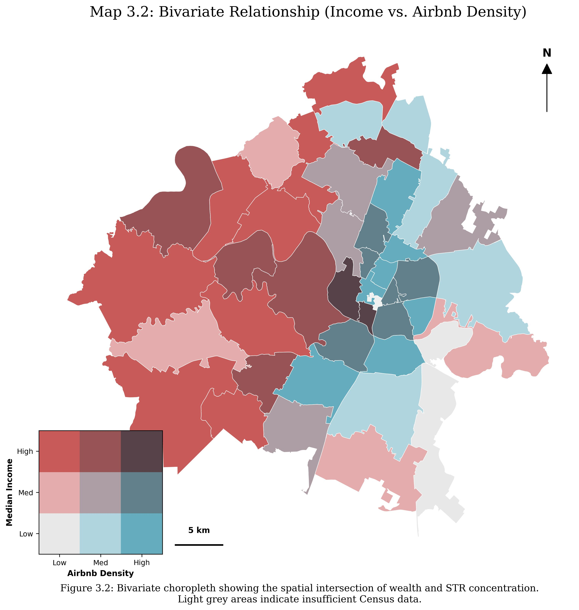

# The Spatial Dynamics of the Sharing Economy: Austin, Texas

This project integrates **Volunteered Geographic Information (VGI)** from Inside Airbnb with **US Census Bureau (ACS)** data to explore how short-term rentals (STRs) intersect with demographic patterns and gentrification.

## 🚀 Key Highlights
*   **Bivariate Analysis:** Identified "Frontier Zones" where low-income neighborhoods face high investor pressure.
*   **Spatial Autocorrelation (LISA):** Mapped statistically significant clusters of wealth and insulation.
*   **Geodemographic Typology:** Used K-Means clustering to categorize neighborhoods into four distinct urban logics.

## 🖼️ Featured Map: Bivariate Relationship

*The intersection of Income (Y-axis) and Airbnb Density (X-axis). Teal areas represent the 'Frontier Zones' of gentrification.*

## 🛠️ Tech Stack
*   **Language:** Python
*   **Spatial Libraries:** GeoPandas, PySAL (LISA), Contextily (Basemaps)
*   **Data Science:** Scikit-Learn (K-Means), Pandas, Matplotlib

## 📊 Data Sources
Note: Raw data is not included in this repository due to size and licensing. 
1. **Inside Airbnb:** Austin Listings (Jan 2025) - [Download here](http://insideairbnb.com/get-the-data/)
2. **US Census Bureau:** ACS 5-Year Estimates (2018-2022) via API.
